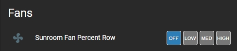
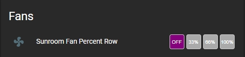

# Fan Percent Button Row
Provides a means to program 3 preset speed percentage settings for fans selectable from a Lovelace button row.

## NOTE: You must be on Home Assistant V2021.3.X or higher to use this plug-in

Installation:

The easiest way to install this is to use the Home Assistant Community Store (HACS) in Home Assistant.

Follow the instructions there for installation making sure you note the "url:" section for the resources addition.


Conversely, if you don't use HACS you can install it manually by performing the following:

Copy the fan-percent-button-row.js file to the appropriate folder in your Home Assistant Configuration directory (/config/www/).

Place the following in your "resources" section in your lovelace configuration (updating the location to where you placed the above file):

  ```
    - url: /local/fan-percent-button-row.js
      type: module
  ```
    
Then to use this in a card place the following in your entity card:


<b>Options:</b>

| Name | Type | Required | Default | Description |
| --- | --- | --- | --- | --- |
| entity | String | Yes | none | any fan entity_id |
| type | String | Yes | none | custom:fan-percent-button-row |
| name | String | No | none | A custom name for the entity in the row |
| customTheme | Boolean | No | false | set to true to use a custom theme |
| customSetpoints | Boolean | No | false | set to true to use custom speed percent setpoints |
| reverseButtons | Boolean | No | false | set to true to reverse the button order |
| isOffColor | String | No | '#f44c09' | Sets the color of the 'Off' button if fan is off |
| isOnLowColor | String | No | '#43A047' | Sets the color of the 'Low' button if fan is on low percent speed |
| isOnMedColor | String | No | '#43A047' | Sets the color of the 'Med' button if fan is on medium percent speed  |
| isOnHiColor | String | No | '#43A047' | Sets the color of the 'Hi' button if fan is on high percent speed |
| buttonInactiveColor | String | No | '#759aaa' | Sets the color of the the buttons if that selection is not "active" |
| lowPercentage | Integer | No | 33 | Sets the speed percentage level for the "Low" button (min 10) |
| medPercentage | Integer | No | 66 | Sets the speed percentage level for the "Med" button  |
| hiPercentage | Integer | No | 99 | Sets the speed level for the "High" button (max 100) |
| customOffText | String | No | 'OFF' | Sets the text of the "off" button |
| customLowText | String | No | 'LOW' | Sets the text of the "low" speed button |
| customMedText | String | No | 'MED' | Sets the text of the "medium" speed button |
| customHiText | String | No | 'HIGH' | Sets the text of the "High" speed button |


The values for the colors can be any valid color string in "HEX", "RGB" or by color name.

If the speed percantage is changed via any other means (slider, service call, etc) the buttons will indicate which range the speed percentage is in based on the setpoint settings in the config.

<b>Configuration Examples:</b>
    
  ```
    cards:
      - type: entities
        title: Hall Fan Presets
        show_header_toggle: false
        entities:
        ## USE THIS CONFIG TO HAVE IT MATCH YOUR THEME ##
          - entity: fan.hall_fan
            type: custom:fan-percent-button-row
            name: Fan Not Custom Theme
            customTheme: false
        ## USE THIS CONFIG TO USE A DEFAULT CUSTOM THEME
          - entity: fan.hall_fan
            type: custom:fan-percent-button-row
            name: Fan Default Custom Theme
            customTheme: true
            customSetpoints: true
            lowPercentage: 30
            medPercentage: 60
            hiPercentage: 90
        ## USE THIS CONFIG TO USE A 'CUSTOMZED' CUSTOM THEME
          - entity: fan.hall_fan
            type: custom:fan-percent-button-row
            name: Fan Custom Custom Theme
            reverseButtons: true
            customTheme: true
            isOnLowColor: 'rgb(255, 0, 0)'
            isOnMedColor: '#888888'
            isOnHiColor: '#222222'
            buttonInactiveColor: '#aaaaaa'
            isOffColor: 'purple'
        ## USE THIS CONFIG TO SET CUSTOM BUTTON TEXT (NOT REQUIRED TO SET "customTheme: true" TO USE THESE )
          - entity: fan.hall_fan
            type: custom:fan-percent-button-row
            name: Fan Custom Button Text
            customHiText: me
            customLowText: do
            customMedText: re
            customOffText: not
            
  ```

This is with the default Lovelace frontend theme set:


This is with the "Slate" frontend theme set:



This is how this plugin looks with the plugin fully themed:



