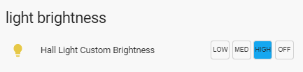
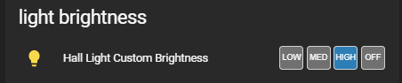

Changes:

- v1.7 & v1.8 - BREAKING CHANGES! - changed the customize options to be consisdent across all my repos and within HA by changing first letter in the options to lowercase. Also added a new "reverseButtons" option to reverse the button order.

- v1.5 - added the ability to customize the text for the buttons. defaults to "OFF, LOW, MED, HIGH"

Provides a means to program 3 preset brightness settings for dimmable lights selectable from a Lovelace button row. THis plugin will also accept a "light group" as the entity_id.

This pluig-in was inspired by user @jazzyisj on the Home Assistant forum (community.home-assistant.io) as a thematically complementary plug-in for my fan control row.

This element is completely theme-able to provide a match to the "fan-control-entity-row" to provide a consistent look for the different elements in your Lovelace frontend

<b>Configuration Examples:</b>
    
  ```
    cards:
      - type: entities
        title: Hall Light Presets
        show_header_toggle: false
        entities:
        ## USE THIS CONFIG TO HAVE IT MATCH YOUR THEME ##
          - entity: light.hall_light
            type: custom:light-brightness-preset-row
            name: Light Not Custom Theme
            customTheme: false
        ## USE THIS CONFIG TO USE A DEFAULT CUSTOM THEME
          - entity: light.hall_light
            type: custom:light-brightness-preset-row
            name: Light Default Custom Theme
            reverseButtons: true
            customTheme: true
            customSetpoints: true
            lowBrightness: 30
            medBrightness: 100
            hiBrightness: 225
        ## USE THIS CONFIG TO USE A 'CUSTOMZED' CUSTOM THEME
          - entity: light.hall_light
            type: custom:light-brightness-preset-row
            name: Light Custom Custom Theme
            customTheme: true
            isOnLowColor: 'rgb(255, 0, 0)'
            isOnMedColor: '#888888'
            isOnHiColor: '#222222'
            buttonInactiveColor: '#aaaaaa'
            isOffColor: 'purple'
            
  ```

This is with the default Lovelace frontend theme set:




This is with the "Slate" frontend theme set:



This is how this plugin looks with the Fan control & Binary Button Rows:


